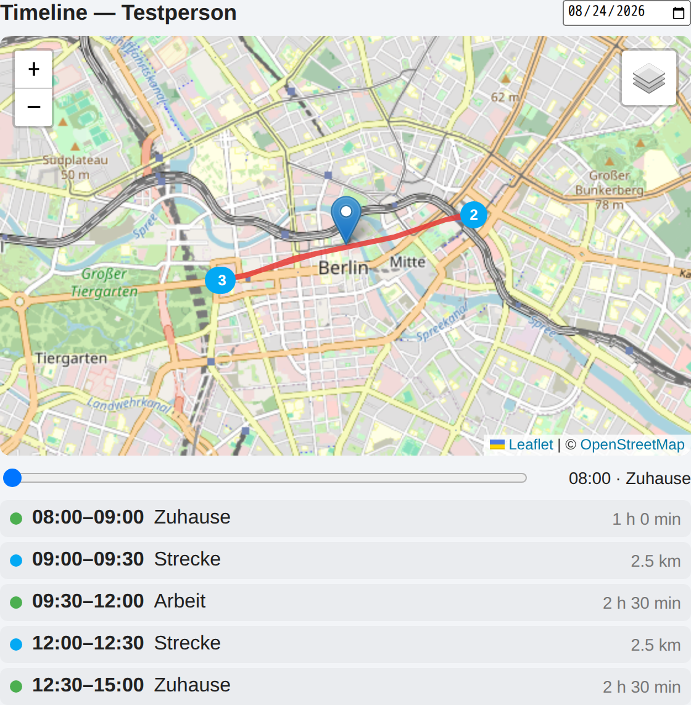
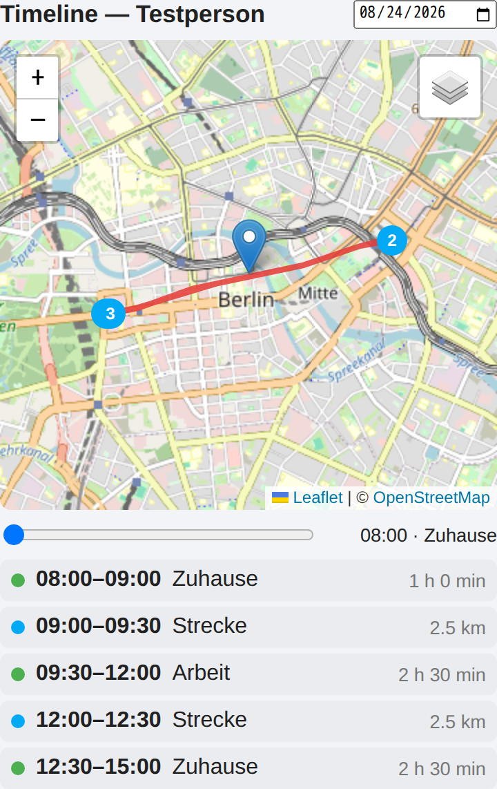

# Local Track Cards

**Der Tagesverlauf einer Person auf der Landkarte: Route, Aufenthalte und ein
Zeit-Scrubber — Googles Zeitachse als Lovelace-Karte.**



| Karte | Wofür |
| --- | --- |
| `localtrack-timeline-card` | Tages-Track einer `person.*`- oder `device_tracker.*`-Entität |

## Voraussetzung

Die Karte braucht die Integration
[**Local Track**](https://github.com/luukkii123/ha-localtrack-integrations) —
sie liefert das WebSocket-Kommando `localtrack/history`, über das die Karte
ausschließlich liest. Die Karte spricht nie mit einem Dritten, außer für die
Kartenkacheln (siehe *Grenzen*).

Ist die Integration installiert, aber kein Eintrag angelegt, meldet die Karte
„Local-Track-Integration nicht eingerichtet."; geht die Abfrage aus einem
anderen Grund schief, „Daten konnten nicht geladen werden."

Warum zwei Repos: In HACS gehört ein Repository zu **genau einer** Kategorie.
Karten und Integrationen lassen sich deshalb nicht zusammen ausliefern.

## Installation über HACS

1. HACS → ⋮ → **Custom repositories**
2. Repository: `https://github.com/luukkii123/ha-localtrack-cards`,
   Kategorie: **Dashboard**
3. **Local Track Cards** herunterladen, Seite hart neu laden (Strg+F5) — sonst
   hängt die alte Datei im Cache.
4. Karte auf ein Dashboard legen: sie erscheint in der Kartenauswahl als
   **Local Track Timeline**, mit Vorschau und grafischem Editor.

Manuell: `dist/localtrack-cards.js` nach `<config>/www/localtrack-cards.js`
kopieren und unter Einstellungen → Dashboards → ⋮ → **Ressourcen** eintragen:
`/local/localtrack-cards.js`, Typ **JavaScript-Modul**.

Voraussetzung: Home Assistant **2024.11.0** oder neuer.

```yaml
type: custom:localtrack-timeline-card
entity: person.beispiel
title: Mein Tag         # optional, sonst die Entitäts-ID
height: 320             # Kartenhöhe in px
stay_radius_m: 150      # Radius, in dem Punkte als „Aufenthalt" gelten
min_stay_minutes: 10    # Mindestdauer eines Aufenthalts
show_scrubber: true     # Zeit-Scrubber ein-/ausblenden
reverse_geocode: false  # Ortsnamen über OSM/Nominatim abfragen
max_points: 2000        # max. Punkte pro Tag
tile_url: ""            # leer = OpenStreetMap, sonst eigener Kachelserver
```

## Optionen

| Option | Pflicht | Standard | Bedeutung |
| --- | --- | --- | --- |
| `entity` | ja | — | eine `person.*`- oder `device_tracker.*`-Entität |
| `title` | nein | Entitäts-ID | Überschrift der Karte |
| `height` | nein | `320` | Kartenhöhe in px (Editor: 240–720) |
| `stay_radius_m` | nein | `150` | bis zu diesem Abstand vom laufenden Mittelpunkt zählen Punkte als ein Aufenthalt (Editor: 10–1000) |
| `min_stay_minutes` | nein | `10` | so lange muss ein Aufenthalt gedauert haben, um zu zählen (Editor: 1–240) |
| `show_scrubber` | nein | `true` | Zeit-Scrubber unter der Karte anzeigen |
| `reverse_geocode` | nein | `false` | Aufenthalte ohne passende Zone über OSM/Nominatim benennen |
| `max_points` | nein | `2000` | so viele Punkte holt die Karte höchstens (Editor: 100–5000) |
| `tile_url` | nein | leer | leer = OpenStreetMap, sonst eine eigene Kachel-URL im Leaflet-Format |

## Bedienung

- **Datum** oben rechts wählen (Standard: heute); die Karte lädt den Track
  dieses Tages.
- **Zeit-Scrubber** unter der Karte: entlang der Route fahren, daneben stehen
  Uhrzeit und Zone (oder „unterwegs").
- **Aufenthalte** und **Strecken** erscheinen als Liste unter der Karte, mit
  Zeitspanne und Dauer bzw. Länge in Kilometern. Ein Klick zentriert die Karte
  darauf.
- Start (grün) und Ende (rot) sind markiert, Aufenthalte als nummerierte Pins in
  der Reihenfolge des Tages.

Aufenthalte werden zuerst gegen die **Zonen** von Home Assistant beschriftet;
passt keine, heißt der Eintrag „Aufenthalt" — oder, mit
`reverse_geocode: true`, wie der von OSM gelieferte Straßen- bzw. Ortsname.

Steht das Datum auf **heute**, lädt die Karte nach einer Positionsänderung
verzögert nach (rund 30 Sekunden). Vergangene Tage ändern sich nicht und werden
nicht neu geladen.

Auf schmalen Spalten rückt die Karte zusammen, die Segmentliste bleibt lesbar:



## Grenzen

- **Noch nicht in einem laufenden Home Assistant getestet.** Die Karte wurde in
  einem Chromium-Container gegen erfundene Daten gerendert; das Zusammenspiel
  mit einer echten Installation steht aus.
- **Kartenkacheln kommen von openstreetmap.org**, solange `tile_url` leer ist.
  Wer das nicht will, trägt einen eigenen Kachelserver ein.
- **`reverse_geocode: true` schickt Koordinaten an einen Dritten**
  (nominatim.openstreetmap.org). Standardmäßig ist das aus; die Zonen-Zuordnung
  bleibt vollständig lokal.
- **Die Routenqualität hängt an der Quelle, nicht am Code.** Die Companion-App
  meldet den Standort im Standardmodus nur bei deutlicher Bewegung oder
  Zonenwechsel — die Linien zwischen den Punkten sind dann gerade. „Hohe
  Genauigkeit" in der App (kostet Akku) liefert dichtere Spuren.
- **Ein Tag auf einmal.** Es gibt keine Wochen- oder Monatsansicht und keinen
  Vergleich mehrerer Personen in einer Karte.
- Liegen mehr Punkte vor als `max_points`, reduziert die **Integration** sie mit
  Douglas-Peucker, bevor die Karte sie sieht.
- Das Datumsfeld zeigt in den Bildern oben `08/24/2026` statt `24.08.2026`. Das
  ist ein Artefakt des Headless-Chromium, der `<input type="date">` fest
  englisch formatiert. Im Browser des Nutzers steht das Datum deutsch.

## Kein Build-Schritt

`dist/localtrack-cards.js` ist Quelltext und Auslieferung in einem: reines
Vanilla-JS mit Custom Elements, kein Bundler. **Keine Unterordner** — eine
HACS-Dashboard-Ressource liefert genau eine Datei aus, alles darunter erreicht
den Browser nie.

Deshalb steckt **Leaflet 1.9.4** (BSD-2-Clause) vollständig in dieser Datei:
die UMD-Fassung, das CSS als injizierter `<style>`, die vier Marker-PNGs als
`data:`-URIs. Nachgeladen wird nichts außer den Kartenkacheln. Das erklärt die
Dateigröße von rund 200 kB. Der Lizenzkopf von Leaflet steht unverändert im
Abschnitt zwischen `BEGIN VENDOR` und `END VENDOR`.

## Geprüft

Das Bild oben stammt aus `docs/render/render.py`: Die ausgelieferte Datei wird
in echtem Chromium gerendert, `ha-card`/`ha-icon`/`ha-form` sind Attrappen, und
`callWS` beantwortet `localtrack/history` mit einem erfundenen Tagesverlauf.

```bash
docker run --rm -v "$PWD:/repo" \
  --entrypoint bash mcr.microsoft.com/playwright/python:v1.62.0-noble \
  -c 'pip install --quiet --break-system-packages playwright==1.62.0 >/dev/null; \
      python3 /repo/docs/render/render.py /repo/dist/localtrack-cards.js \
              /repo/docs/render/ergebnis 620'
```

Der Lauf protokolliert **jede** Netzanfrage nach `report.json`. Bei 620 px
waren es 11 Anfragen — Seite, JS-Datei und 9 Kartenkacheln —, alle
Fehlerlisten (`vendor_requests`, `bad_responses`, `request_failures`,
`console_errors`, `page_errors`) leer. Marker und Schatten kamen als
`data:`-URIs an (50×82 bzw. 41×41 px), es gab **keinen** Versuch, aus einem
Unterordner nachzuladen.

## Herkunft

Die Karte hieß bis Version 0.3.0 von
[`ha-busch-cards`](https://github.com/luukkii123/ha-busch-cards)
`busch-timeline-card` und lag dort in derselben Datei wie die Zeitplan-Karte.
Sie ist hierher umgezogen, weil sie zur Integration `localtrack` gehört: ein
gemeinsames Repo hieße eine gemeinsame Version und ein gemeinsames Release für
Karten, die nichts miteinander zu tun haben. Wer den Zeitplan-Editor will,
sollte nicht Leaflet mitinstallieren müssen.

**Wer die alte Karte auf einem Dashboard hat**, ändert `type:` von
`custom:busch-timeline-card` auf `custom:localtrack-timeline-card`. Die
Optionen sind unverändert.

## Lizenz

MIT — siehe [LICENSE](LICENSE). Das eingebettete Leaflet steht unter
BSD-2-Clause, (c) 2010–2023 Vladimir Agafonkin, (c) 2010–2011 CloudMade.
